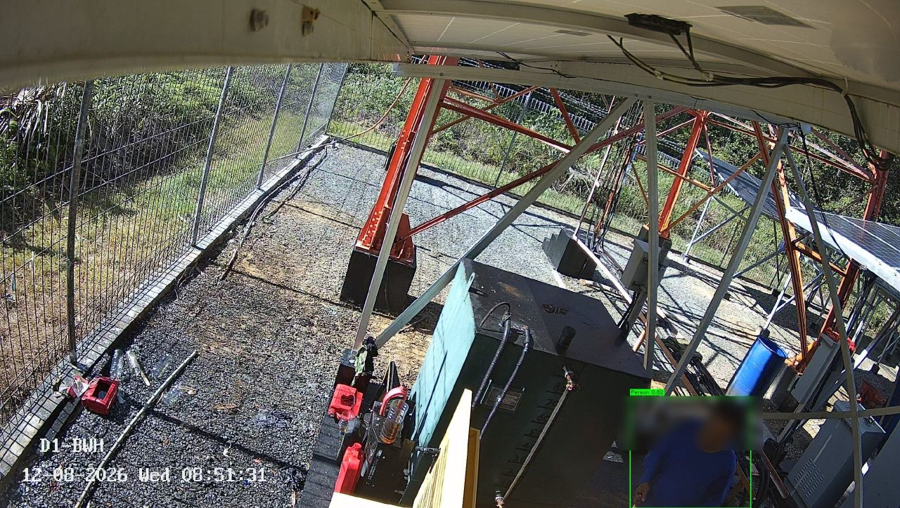
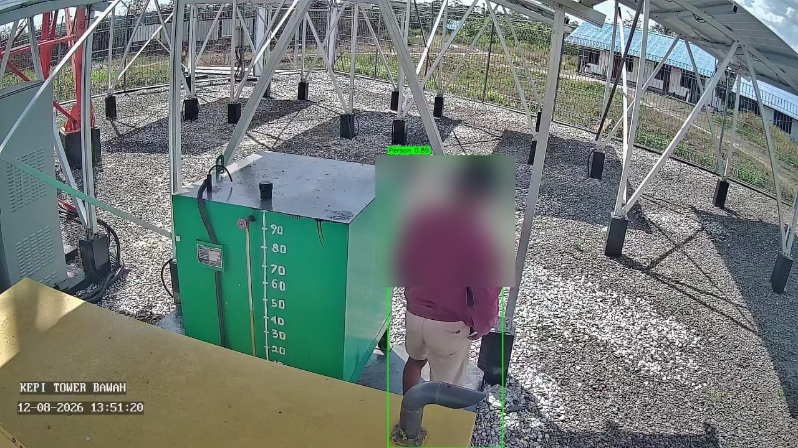
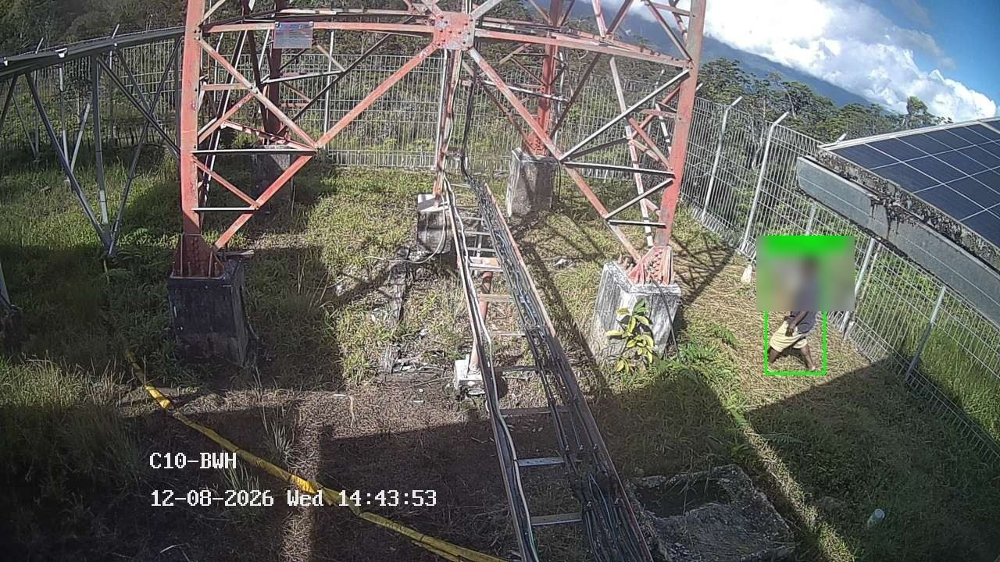

# 📹 CCTV Human Detection Monitor

Sistem monitoring CCTV multi-site yang mendeteksi keberadaan manusia secara otomatis dan mengirim alert real-time ke Telegram — dibangun untuk mengawasi puluhan kamera lintas lokasi terpencil dengan kombinasi kamera cloud (EZVIZ) dan kamera RTSP langsung (Hikvision/Amtek).

> 🔒 **Catatan tentang repo ini:** Ini adalah versi portofolio yang sudah disanitasi dari project produksi yang saya bangun dan jalankan. Semua kredensial, IP, dan data kamera asli telah diganti dengan contoh/dummy (`*.example.json`, `.env.example`). Struktur kode, logika, dan arsitekturnya identik dengan yang berjalan di produksi.

---

## 🎯 Latar Belakang & Masalah yang Diselesaikan

Jaringan CCTV yang saya kelola tersebar di banyak site remote (repeater/tower telekomunikasi), sebagian pakai kamera EZVIZ (hanya bisa diakses via cloud API, tidak ada RTSP langsung yang stabil di semua unit), sebagian lagi Hikvision/Amtek yang bisa diakses RTSP langsung di jaringan lokal.

Kebutuhannya:
- Deteksi kehadiran manusia otomatis (potensi intrusi ke area terlarang) tanpa harus ada orang yang menonton live feed 24/7.
- **False alarm harus ditekan serendah mungkin** — kamera outdoor di area terpencil sangat rentan false trigger dari daun bergoyang, serangga di lensa, perubahan cahaya, watermark timestamp kamera, dll. Alert yang terlalu berisik membuat tim mengabaikan notifikasi (alert fatigue).
- Dua jenis sumber kamera dengan cara akses yang sama sekali berbeda harus tetap menghasilkan **format alert dan perilaku anti-spam yang konsisten**.
- Sistem harus tetap jalan tanpa pengawasan (unattended), termasuk pulih sendiri dari koneksi kamera yang putus-nyambung (umum terjadi di link radio/microwave ke site remote).

---

## 🏗 Arsitektur

Dua pipeline independen, berbagi dua modul inti supaya perilaku & format alert tetap konsisten:

```
┌──────────────────────────┐        ┌────────────────────────────┐
│  ezviz_cloud_monitor.py  │        │  nonezviz_rtsp_monitor.py   │
│  (kamera cloud EZVIZ)     │        │  (kamera RTSP langsung)     │
│                           │        │                              │
│  Poll cloud API tiap 60s  │        │  Poll RTSP tiap 45s          │
│  untuk alarm human        │        │  + real-time push motion     │
│  detection dari cloud     │        │  event via ISAPI (opsional)  │
└─────────────┬─────────────┘        └───────────────┬──────────────┘
              │                                       │
              ▼                                       ▼
      ┌──────────────────────────────────────────────────────┐
      │       common_human_verifier_yolo.py (YOLOv8n)          │
      │  Verifikasi visual tahap kedua sebelum alert dikirim    │
      └──────────────────────────┬─────────────────────────────┘
                                 ▼
      ┌──────────────────────────────────────────────────────┐
      │           common_telegram_notifier.py                  │
      │       Alert terformat konsisten ke Telegram             │
      └──────────────────────────────────────────────────────┘
```

Kenapa dipisah jadi dua pipeline, bukan satu sistem generik? Karena EZVIZ **tidak** menyediakan RTSP yang bisa diandalkan di seluruh unit (banyak yang di-relay lewat cloud saja), sehingga cara "mendengar" event-nya secara fundamental berbeda: satu lewat polling REST cloud API, satu lagi lewat RTSP + event push langsung ke device. Memaksakan satu abstraksi untuk keduanya akan membuat kode lebih rumit daripada manfaatnya — jadi saya pisah pipeline-nya, tapi satukan logika yang memang sama (verifikasi & notifikasi) di modul bersama.

---

## 🧠 Keputusan Teknis yang Menarik

Beberapa bagian yang menurut saya paling menunjukkan proses berpikir di balik sistem ini:

**1. Verifikasi dua tahap, bukan cuma motion detection.**
Motion detection/alarm cloud dipakai sebagai *trigger* awal saja (murah secara komputasi), lalu setiap trigger diverifikasi ulang dengan YOLOv8n sebelum alert benar-benar dikirim. Ini memisahkan concern "ada sesuatu yang bergerak" dari "yang bergerak itu memang manusia" — trade-off yang jelas menekan false alarm meski menambah 1 inference per trigger.

**2. Filter aspek rasio, bukan cuma confidence & ukuran box.**
Awalnya filter hanya pakai confidence + ukuran box minimum — masih sering false positive dari watermark timestamp kamera (teks kecil kadang ke-detect sebagai "person" dengan confidence lumayan tinggi). Solusinya menambahkan filter rasio tinggi/lebar box: manusia berdiri selalu lebih tinggi daripada lebar, sedangkan teks/watermark selalu lebih lebar daripada tinggi. Filter ini menangkap kasus yang tidak tertangkap oleh ambang ukuran saja, sambil tetap membiarkan orang yang kecil/jauh di frame lolos.

**3. Enhancement kondisi malam otomatis.**
YOLOv8n (dilatih mayoritas dengan citra siang hari) cenderung under-detect pada frame IR malam yang low-contrast. Sistem mengecek brightness rata-rata tiap frame dan menerapkan CLAHE (contrast enhancement lokal) hanya pada frame yang memang gelap — supaya tidak membebani/mendistorsi frame siang yang sudah cukup terang.

**4. Anti-spam dengan eskalasi, bukan cooldown statis.**
Kamera yang terus-menerus re-trigger (misal karena posisi kamera bergeser sedikit dan mulai menangkap objek statis tertentu) dinaikkan ke cooldown yang jauh lebih panjang setelah beberapa kali suppressed berturut-turut, alih-alih terus mengirim di cooldown pendek yang sama — mengurangi alert fatigue tanpa harus mematikan kamera itu sepenuhnya.

**5. Real-time push + fallback poll, bukan salah satu saja.**
Untuk kamera yang mendukung ISAPI, sistem tidak hanya polling reguler (lebih lambat merespons) atau hanya push event (rawan diam-diam terputus tanpa terdeteksi) — tapi keduanya: push untuk respons cepat, dengan polling fallback berkala sebagai jaring pengaman kalau koneksi push putus tanpa error yang jelas.

**6. Toleransi penamaan yang tidak konsisten antar sumber data.**
Nama kamera yang dilaporkan oleh cloud API / RTSP kadang tidak 100% sama dengan yang tercatat di data induk (`BAWAH` vs `BWH`, `ATAS` vs `ATS`, beda spasi/kapital). Modul pemetaan site menormalisasi nama sebelum pencocokan, dengan fallback ke nomor serial, lalu partial match — supaya alert tidak pernah "salah site" hanya karena selisih penamaan.

---

## ✨ Fitur

- Dua pipeline monitoring independen (cloud API & RTSP langsung) dengan format alert & anti-spam yang konsisten.
- Verifikasi visual dua tahap berbasis YOLOv8n untuk menekan false alarm.
- Auto contrast-enhancement untuk frame malam/IR sebelum inferensi.
- Filter gabungan confidence + rasio ukuran + rasio aspek untuk membedakan manusia dari artefak/watermark.
- Ignore zones & threshold deteksi yang bisa di-override per kamera.
- Real-time motion push (ISAPI) dengan fallback polling sebagai jaring pengaman.
- Anti-spam dengan eskalasi cooldown otomatis untuk kamera yang "berisik".
- Pemetaan Site/Cluster/IP yang toleran terhadap variasi penamaan.
- Auto-cleanup snapshot lama & retry snapshot yang gagal terkirim.

---

## 🛠 Tech Stack

| Kategori | Teknologi |
|---|---|
| Bahasa | Python 3.9+ |
| Computer Vision | YOLOv8n (Ultralytics), OpenCV |
| Concurrency | `threading`, `ThreadPoolExecutor` |
| Integrasi | EZVIZ Cloud API (via `pyezvizapi`), Hikvision ISAPI, Telegram Bot API |
| Protokol Streaming | RTSP (via FFmpeg/OpenCV) |
| Config & State | JSON, environment variables |

---

## 📁 Struktur Project

```
.
├── ezviz_cloud_monitor.py            # Pipeline kamera EZVIZ (cloud API)
├── nonezviz_rtsp_monitor.py          # Pipeline kamera Hikvision/Amtek (RTSP)
├── nonezviz_isapi_motion_listener.py # Real-time motion push listener (ISAPI)
├── site_mapper_ezviz.py              # Lookup Site/Cluster/IP + override deteksi
├── common_human_verifier_yolo.py     # Verifikasi visual manusia (YOLOv8n)
├── common_telegram_notifier.py       # Notifikasi Telegram
├── site_mapping_ezviz.example.json   # Contoh konfigurasi kamera EZVIZ
├── nonezviz_cameras_config.example.json # Contoh konfigurasi kamera Hikvision/Amtek
├── .env.example                      # Template environment variable
└── requirements.txt
```

---

## ⚙️ Menjalankan Secara Lokal

```bash
git clone <repo-url>
cd <repo-folder>

python3 -m venv venv
source venv/bin/activate        # Windows: venv\Scripts\activate
pip install -r requirements.txt

cp .env.example .env            # lalu isi kredensial Anda sendiri
cp site_mapping_ezviz.example.json site_mapping_ezviz.json
cp nonezviz_cameras_config.example.json nonezviz_cameras_config.json
# edit kedua file config di atas sesuai kamera Anda

python ezviz_cloud_monitor.py       # untuk kamera EZVIZ
python nonezviz_rtsp_monitor.py     # untuk kamera Hikvision/Amtek
```

Uji cepat modul verifikasi YOLO secara mandiri:

```bash
python common_human_verifier_yolo.py path/ke/foto.jpg
```

---

## 🔍 Detail Cara Kerja

### Pipeline EZVIZ
1. Polling cloud API tiap 60 detik untuk alarm human detection.
2. Cocokkan device ke daftar termonitor (toleran variasi nama).
3. Terapkan cooldown anti-spam per kamera.
4. Unduh snapshot alarm dari cloud.
5. Verifikasi ulang dengan YOLOv8n sebelum mengirim alert.

### Pipeline Hikvision/Amtek
1. Kamera ber-ISAPI didengarkan real-time; motion langsung memicu pengecekan (dengan debounce).
2. Kamera lainnya dipoll RTSP langsung tiap 45 detik, paralel hingga 20 kamera.
3. Kamera ISAPI tetap ikut fallback poll berkala sebagai jaring pengaman.
4. Setiap capture diverifikasi YOLOv8n sebelum alert dikirim.

### Verifikasi Visual
Tiga sinyal digabungkan untuk memutuskan apakah sebuah deteksi benar-benar manusia: confidence YOLO, rasio tinggi box terhadap frame, dan rasio aspek (tinggi/lebar) box.

---

## 📨 Contoh Format Alert

```
🚨 HUMAN DETECTION ALERT 🚨

Site      : REPEATER SITE-1
Device    : SITE1-CAM-LOWER (SN: EXAMPLE0001)
IP        : 192.168.1.101
Cluster   : REGION-A
Waktu     : 2026-08-12 14:32:10
Source    : EZVIZ

--Notification CCTV--
```

### Contoh Output Deteksi (screenshot asli, wajah diburamkan)

Ini bukan mock-up — ini adalah snapshot asli yang diproses dan dikirim oleh sistem, dari ketiga sumber kamera yang didukung. Kotak hijau `Person X.XX` digambar otomatis oleh `draw_boxes_on_image()` setelah deteksi YOLO lolos verifikasi.

| Hikvision (RTSP) | Amtek (RTSP + ISAPI push) | EZVIZ (Cloud API) |
|---|---|---|
|  |  |  |

> 🔒 Wajah pada ketiga foto di atas sengaja diburamkan sebelum diunggah ke repo publik ini untuk melindungi privasi individu yang tertangkap kamera — mereka adalah petugas lapangan yang tidak memberi persetujuan untuk fotonya dipakai sebagai contoh publik. Nama site pada overlay kamera juga contoh kode internal, bukan alamat/lokasi persis.

---

## 🚧 Kemungkinan Pengembangan Berikutnya

- Dashboard web ringan untuk melihat status kamera & histori alert tanpa harus scroll Telegram.
- Model deteksi custom-trained pada dataset CCTV IR malam untuk mengurangi ketergantungan pada contrast enhancement.
- Dukungan multi-channel notifikasi (WhatsApp/email) selain Telegram.
- Metrik & logging terpusat (Prometheus/Grafana) untuk memantau kesehatan kedua pipeline.

---

## 📄 Lisensi

MIT — silakan gunakan/modifikasi kode ini untuk pembelajaran atau project Anda sendiri.
